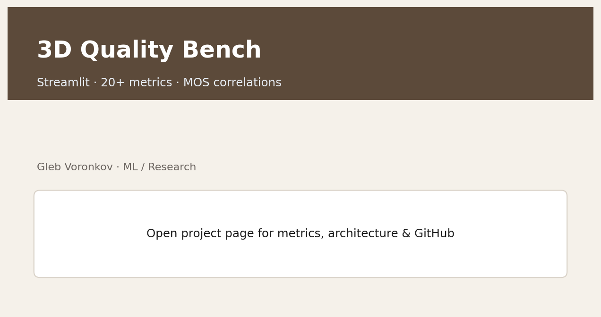
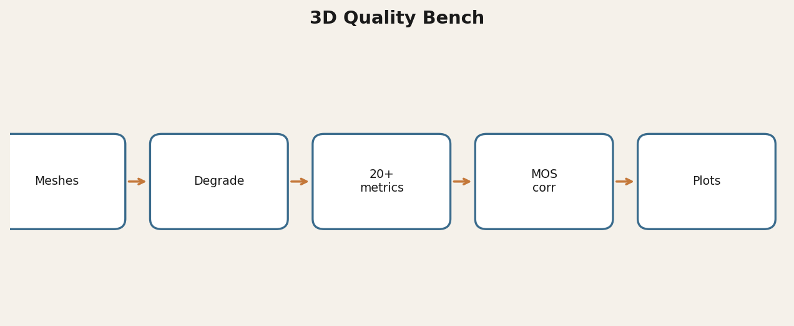

# 3D Quality Bench

Streamlit research platform for **full-reference 3D mesh quality**: PLER family metrics, classic geometric metrics, controllable degradations, and correlations with MOS (PLCC / SROCC / Kendall).

[](https://www.python.org/)
[](LICENSE)
[](https://glebvoronkov03.github.io/gleb-web-portfolio/projects/bench.html)

> Author: **Gleb Voronkov** · Non-commercial research license.

## Demo



## Why it matters
One place to generate distorted meshes (noise, smoothing, decimation, hybrid), compute 20+ metrics, normalize scores, and compare against subjective MOS — useful for codec research, XR content QA, and metric development.

## Architecture



## Quickstart
```powershell
python -m venv .venv
# Windows: .\.venv\Scripts\Activate.ps1  |  Linux/macOS: source .venv/bin/activate
pip install -r requirements.txt
streamlit run app.py
```

Tiny OBJ fixtures live in `data/fixtures/`. Large binaries are intentionally not shipped.

## Results
- 20+ metric wrappers + degradation generators in one UI
- PLCC / SROCC / Kendall vs MOS correlation helpers
- Cross-link with core library: [pler-3d-quality](https://github.com/GlebVoronkov03/pler-3d-quality)

## License & citation
**Non-Commercial Research License** (`LICENSE`). Commercial use → `mybook3@mail.ru` / `@Gleb_Voronkov`.

## Links
- Portfolio: [https://glebvoronkov03.github.io/gleb-web-portfolio/projects/bench.html](https://glebvoronkov03.github.io/gleb-web-portfolio/projects/bench.html)
- Related: [pler-3d-quality](https://github.com/GlebVoronkov03/pler-3d-quality)
